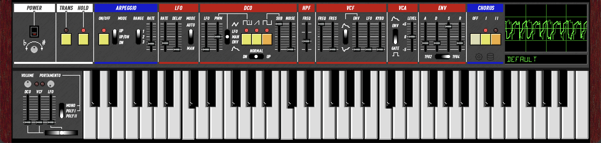

# Junofy

[](LICENSE)

**Junofy** is a Juno-6/60/106-class synthesizer plugin. The **DSP engine, factory presets, and core processor** come from [Ultramaster KR-106](https://github.com/kayrockscreenprinting/ultramaster_kr106) (GPL-3). This combined work is distributed under GPLv3; see [NOTICE](NOTICE), [LICENSE](LICENSE), and [THIRD_PARTY_LICENSES](THIRD_PARTY_LICENSES). Obtain matching source from this repository or from upstream KR-106 as applicable.

[](https://github.com/kayrockscreenprinting/ultramaster_kr106/actions/workflows/release.yml)

A synthesizer plugin emulating the Roland Juno-6, Juno-60, and Juno-106, built with [JUCE](https://juce.com/) (GPL licensing path for distribution of this project).



**Demo:** [junofy-demo.mp3](docs/audio/junofy-demo.mp3) (example take from the plugin in FL Studio).

6-voice polyphonic with dual-mode DSP (Juno-60 analog / Juno-106 firmware), per-voice analog variance,
TPT ladder filter with OTA saturation, ngspice-verified BBD chorus, arpeggiator with DAW sync,
portamento, and 240 factory presets (112 Juno-60 + 128 Juno-106). Parameter curves calibrated from hardware
measurements, circuit simulation, and firmware analysis.

**Formats:** AU (macOS), VST3, CLAP, Standalone; LV2 on Linux/Windows (macOS CMake omits LV2 because the stock LV2 manifest helper can crash on some Apple toolchains).
**Platforms:** macOS (10.15+), Windows, Linux

**SysEx:** Full Juno-106 SysEx support (IPR/APR send and receive). A separate AU variant
(aumf) is included for Logic Pro, which blocks SysEx on standard AU instruments.

**[Download latest release](https://github.com/kayrockscreenprinting/ultramaster_kr106/releases/latest)**

See [docs/DSP_ARCHITECTURE.md](docs/DSP_ARCHITECTURE.md) for a detailed writeup of the
signal chain and emulation techniques.

## Building

### macOS

Requires **CMake** (3.22+) and **Xcode** (or Command Line Tools).

```bash
git clone --recursive <this-repo-url> junofy
cd junofy
make build    # AU, VST3, LV2, Standalone
make run      # Build and launch Standalone (macOS)
```

### Windows

Requires **CMake** (3.22+) and **Visual Studio 2022** (or Build Tools with C++ workload).

```bash
git clone --recursive <this-repo-url> junofy
cd junofy
cmake -B build -DCMAKE_BUILD_TYPE=Release
cmake --build build --config Release
```

Plugins are output to `build/Junofy_artefacts/Release/` (or your chosen build directory).

### Linux

Requires **CMake** (3.22+) and a C++17 compiler.

```bash
git clone --recursive <this-repo-url> junofy
cd junofy
make deps     # Install ALSA, X11, freetype, etc. (apt)
make build    # VST3, LV2, Standalone
```

For a release build:

```bash
CONFIG=Release make build
```

**Packagers:** If the build fails trying to copy plugins to `~/.lv2/` or similar
system directories, disable the post-build copy:

```bash
cmake -B build -DCMAKE_BUILD_TYPE=Release -DJUNOFY_COPY_AFTER_BUILD=OFF
cmake --build build --config Release
```

Run `make help` for all available targets.

## Project Structure

```
Source/
  PluginProcessor.cpp/h        Audio processor, parameter setup, preset management
  JunofyEditor.cpp/h           Vaporwave-style editor (sliders, presets, keyboard)
  JunofyLookAndFeel.cpp/h      Custom LookAndFeel
  KR106_Presets_JUCE.h         240 factory presets (112 J60 + 128 J106)

  Controls/
    KR106Knob.h                Bitmap rotary knob (sprite sheet)
    KR106Slider.h              Pixel-perfect vertical fader
    KR106Switch.h              3-way toggle switch (vertical/horizontal)
    KR106Button.h              Momentary button with LED
    KR106Keyboard.h            On-screen keyboard with transpose
    KR106Scope.h               Oscilloscope with clickable vertical zoom
    KR106Bender.h              Pitch bend lever
    KR106Tooltip.h             Parameter value tooltip overlay

  DSP/
    KR106_DSP.h                Top-level DSP orchestrator, HPF, signal routing
    KR106_DSP_SetParam.h       Per-model parameter dispatch (J6/J60/J106 curves)
    KR106Voice.h               Per-voice: VCF, ADSR, oscillator mixing, portamento
    KR106OscillatorsWT.h       Bandlimited wavetable saw, pulse, sub
    KR106VCF.h                 TPT SVF ladder filter with OTA saturation model
    KR106Chorus.h              MN3009 BBD chorus with Hermite interpolation
    BBDFilter.h                Chorus pre/post filter (Butterworth biquad, ngspice-verified)
    KR106LFO.h                 Global triangle LFO with delay envelope
    KR106ADSR.h                Dual-mode ADSR (analog RC / firmware integer)
    KR106Arpeggiator.h         Note sequencer with DAW sync (Up / Down / Up-Down)
    KR106ParamValue.h          Unified parameter display (Hz, ms, dB, cents)
    KR106VcfFreqJ6.h           J6/J60 VCF frequency curves (circuit models)
    KR106VcfFreqJ106.h         J106 VCF frequency (firmware integer math)

docs/
  DSP_ARCHITECTURE.md          Detailed DSP design documentation
  HOLD_ARP_FLOW.md             Hold + arpeggiator interaction flow

tools/
  preset-gen/                  Original patch files and conversion utilities
  preset-midi/                 MIDI file generator for hardware A/B testing
  render-midi/                 Offline MIDI renderer (headless DSP)
```

## Contributing

See [CONTRIBUTING.md](CONTRIBUTING.md) for guidelines on submitting issues and pull requests.

## License

This project is licensed under the [GNU General Public License v3.0](LICENSE).
Third-party library licenses are listed in [THIRD_PARTY_LICENSES](THIRD_PARTY_LICENSES).
